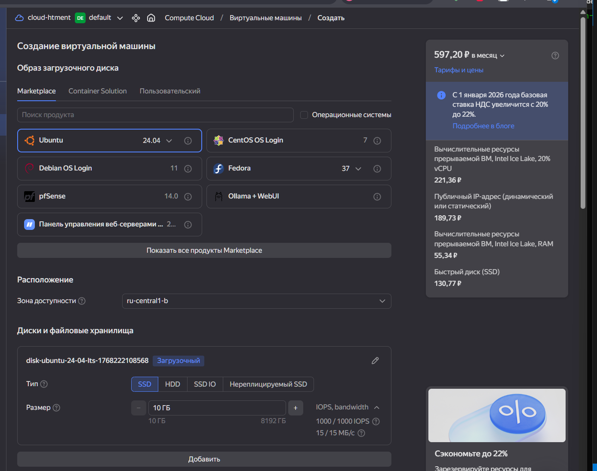
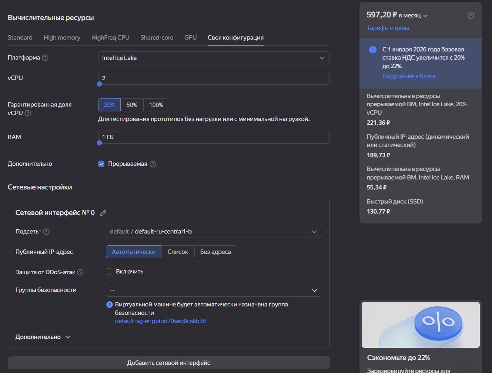
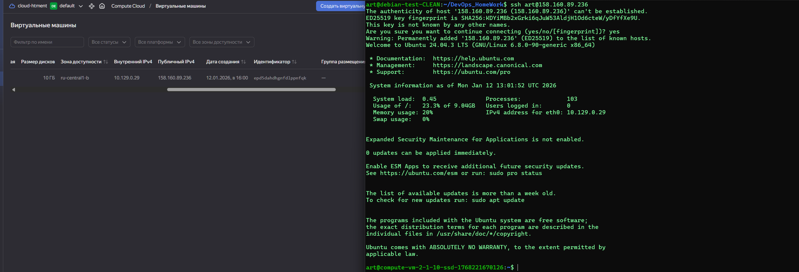
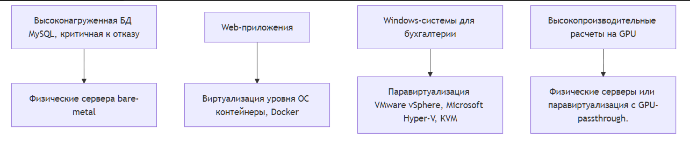

Задание
https://github.com/netology-code/virtd-homeworks/tree/shvirtd-1/05-virt-01-basics
# Задача 1: Создать виртуалку в облаке

# Задача 2: Выбор платформы

[схема](Schema.mermaid)

# Задача 3: Выбор системы управления виртуализацией

1. ### 100 ВМ
 Windows-инфраструктура, балансировка, репликация, бекапы	VMware vSphere (vCenter + ESXi) или Microsoft System Center + Hyper-V.	Обе системы являются корпоративными стандартами. VMware vSphere предоставляет все требуемые функции "из коробки" (vSphere HA, DRS, vMotion, Site Recovery Manager, Veeam-совместимость) с превосходной поддержкой Windows. Стек Microsoft (Hyper-V + SCVMM) глубже интегрирован с ОС Windows, Active Directory и может быть экономически выгоднее при наличии лицензий Windows Server Datacenter.

2. ### Производительное, бесплатное, open-source для 20-30 серверов

Proxmox VE или oVirt/RHV.	Proxmox VE — отличный выбор для смешанной среды. Это полноценная, современная платформа с удобным веб-интерфейсом, поддержкой KVM и контейнеров LXC, встроенным бэкэпом. Бесплатная версия имеет весь функционал. oVirt — мощный open-source аналог vSphere от Red Hat, но требует больше усилий для развертывания и поддержки.

3. ### Бесплатное, совместимое для Windows-инфраструктуры

Hyper-V Server (бесплатный) или KVM с драйверами virtio.	Бесплатный Hyper-V Server — это изолированная роль от Microsoft, обеспечивающая максимальную совместимость и поддержку всех фич Windows гостевых ОС (динамическая память, Secure Boot, режим сеансов). Управление — через Windows Admin Center или с ПК с Windows. KVM с правильно настроенными гостевыми драйверами также показывает отличную производительность для Windows, но требует больше экспертизы в настройке.

4. ### Окружение для тестирования на нескольких дистрибутивах

Linux	Vagrant (+ VirtualBox / Libvirt + KVM) или Docker.	Vagrant создан именно для этой цели. Он позволяет описывать виртуальные машины (образы разных дистрибутивов — 'boxes') кодом (Vagrantfile), быстро поднимать и уничтожать их одной командой. В качестве провайдера использует VirtualBox (проще) или Libvirt/KVM (производительнее). Docker легче и быстрее, если тестируемому ПО не нужна специфичная версия ядра или система инициализации.

# Задание 4: Гетерогенная среда виртуализации

#### Гетерогенная среда виртуализации — это когда в одной компании используют несколько разных систем виртуализации одновременно. Например, часть серверов работает на VMware, часть — на Hyper-V, а часть — на KVM.

### Проблемы такой среды:
1. Сложно управлять — нужно знать несколько разных систем
2. Дорого — платим за разные лицензии и обучение сотрудников
3. Неудобно — для резервного копирования, мониторинга и восстановления нужны разные инструменты
4. Неэффективно — нельзя легко перебрасывать ресурсы между разными системами
5. Рискованно — сложнее обеспечить единый уровень безопасности
### Как уменьшить проблемы:
* Стандартизировать процессы — делать бекапы, обновления и мониторинг по единым правилам
Использовать общие инструменты типа Terraform, которые работают с разными системами
* Четко разделить — например, VMware использовать для важных систем, а KVM — для тестовых
Автоматизировать рутинные задачи
### Вывод
В идеале лучше использовать одну систему виртуализации (гомогенная среда), так как это проще и дешевле. Но если приходится использовать несколько систем, нужно:

* Планировать это заранее
* Стандартизировать подходы
* Автоматизировать управление

Главное — не допускать хаотичного смешения разных систем без четких правил.